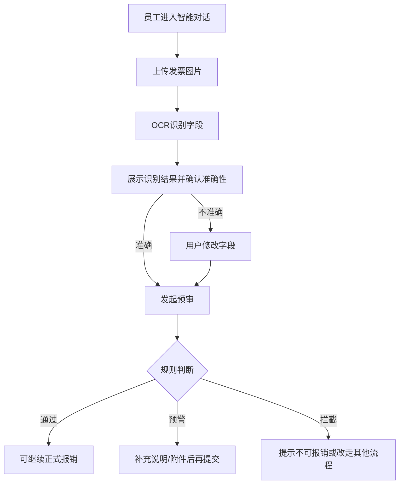
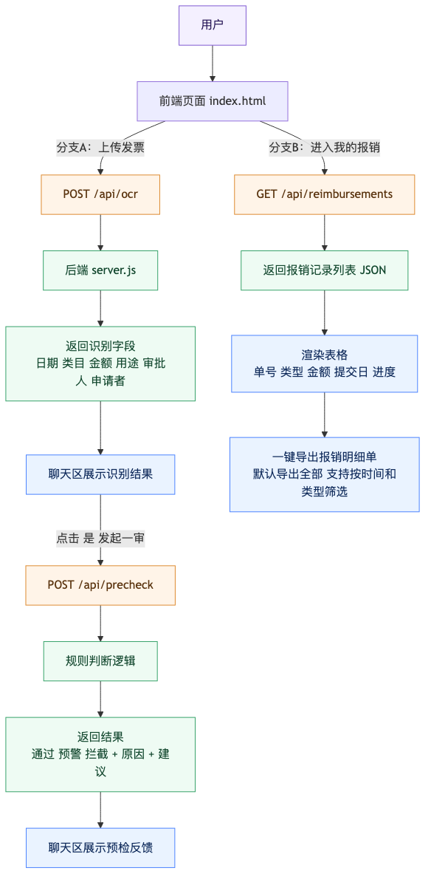

# AI报销预检助手 产品需求文档（v1.2）

文档状态：草稿待评审

---

## 一、项目背景

### 1.1 产品定位

AI报销预检助手定位为「报销前置风控助手」，通过自然语言交互与发票识别能力，为企业员工提供实时合规判断与修改建议，在报销提交前拦截不合规项，降低财务审核驳回率。

### 1.2 业务目标

| 目标指标 | 当前基线 | 目标值 | 提升幅度 |
|---|---:|---:|---:|
| 报销驳回率 | 25% | <=10% | -60% |
| 员工提报等待时长 | 2-3天 | 即时反馈 | - |
| 财务审核效率 | 5分钟/单 | 2分钟/单 | -60% |

### 1.3 价值主张

- 对员工：报销前获得实时反馈，减少因不确定导致的反复修改。
- 对财务：减少人工审核工作量，聚焦异常项专项处理。
- 对企业：强化费用控制意识，降低合规风险。

### 1.4 应用场景

| 场景 | 端 | 说明 |
|---|---|---|
| 报销前自检 | Web / 移动端 | 员工在提交报销前进行合规检查 |
| 移动端快速识别 | iOS / Android | 员工拍摄发票即时获取合规建议 |

---

## 二、需求概述

### 2.1 用户痛点

- 员工端：报销规则繁多，提交前不确定是否合规，多次被驳回影响体验。
- 财务端：大量标准项审核消耗人力，异常项处理效率低。
- 管理层：缺乏数据支撑的费控分析，难以量化问题。

### 2.2 业务价值

- 员工在报销提交前获得 AI 实时预判，减少不确定性。
- 财务聚焦处理真正需要人工介入的异常项。
- 积累报销数据，为后续费控策略优化提供依据。

### 2.3 预期收益

| 指标 | 预期值 | 衡量方式 |
|---|---:|---|
| 合规判断采纳率 | >=80% | 员工按照建议修改后通过的比例 |
| AI 判断准确率 | >=95% | 与财务最终判断一致的比例 |
| 用户满意度 | >=4.0/5.0 | 员工使用后满意度调研 |

### 2.4 版本范围

| 版本 | 范围 |
|---|---|
| V1.0（当前） | 单张发票识别 + 合规规则判断 + 基础交互 |
| V2.0（规划） | 多张发票批量处理 + 历史记录分析 + 智能推荐 |
| V3.0（规划） | 企业知识库集成 + 自定义规则配置 + 数据看板 |

---

## 三、用户需求

### 3.1 目标用户

| 用户角色 | 特征描述 | 核心诉求 |
|---|---|---|
| 普通员工 | 每月提交 3-10 次报销，使用频率中等 | 快速获得合规判断，减少返工 |
| 高频报销员工 | 每月提交 20+ 次报销，使用频率高 | 高效批量操作，减少等待时间 |
| 财务人员 | 负责审核报销单据 | 减少标准项审核，快速定位异常 |

### 3.2 使用场景

**场景 1：报销前自检**

- 触发条件：员工整理好发票，准备提交报销。
- 用户行为：上传发票或输入报销描述。
- 期望结果：即时获得「通过/警告/拦截」判断及修改建议。

**场景 2：移动端快速识别**

- 触发条件：员工出差取得发票，现场拍照。
- 用户行为：拍摄发票并发送。
- 期望结果：即时获得发票内容识别结果与合规建议。

**场景 3：规则咨询**

- 触发条件：员工不确定某类费用能否报销。
- 用户行为：输入自然语言描述报销情况。
- 期望结果：获得规则解读与操作建议。

### 3.3 核心需求

- 发票拍照上传后，5秒内返回识别结果。
- 明确告知当前报销「是否合规」及原因。
- 提供具体修改建议，而非仅告知「不合规」。

---

## 四、功能需求

### 4.1 功能列表与优先级

| 功能模块 | 功能点 | 优先级 | 说明 |
|---|---|---|---|
| 发票识别 | 拍照上传识别 | P0 | 支持拍照/相册选择 |
| 发票识别 | OCR 字段提取 | P0 | 提取发票号、金额、日期等 |
| 发票识别 | 字段手动修正 | P1 | 识别不准时支持手动修改 |
| 合规判断 | 规则引擎匹配 | P0 | 根据规则返回合规状态 |
| 合规判断 | 合规状态展示 | P0 | 通过/警告/拦截三种状态 |
| 合规判断 | 规则解释 | P0 | 告知用户哪条规则触发 |
| 对话交互 | 自然语言咨询 | P1 | 支持报销规则问答 |
| 对话交互 | 多轮对话 | P2 | 支持追问与补充 |
| 辅助信息 | 风险案例展示 | P1 | 展示典型违规案例 |
| 辅助信息 | 规则解读 | P1 | 提供政策原文或解释 |
| 辅助信息 | 操作建议 | P1 | 引导用户下一步操作 |

### 4.2 功能依赖关系

发票识别模块 -> 合规规则引擎（依赖：企业报销规则库）-> 合规判断结果 + 建议输出 -> 对话交互（可独立使用）。

### 4.3 外部依赖

| 依赖系统 | 依赖内容 | 优先级 |
|---|---|---|
| OCR 服务 | 发票文字识别 | P0 |
| 规则引擎 | 合规判断逻辑 | P0 |
| 规则知识库 | 报销政策规则 | P0 |
| 消息推送服务 | 提醒通知 | P2 |

---

## 五、业务流程

### 5.1 正常流程

- [Step 1] 首页入口：用户进入 AI 报销预检助手。
- [Step 2] 输入报销信息（二选一）：方式 A - 上传发票图片；方式 B - 输入自然语言描述。
- [Step 3] AI 处理：发票识别 -> 信息确认 -> 合规判断。
- [Step 4] 结果展示：合规状态 + 规则说明 + 操作建议。
- [Step 5] 用户操作：采纳建议或忽略继续（记录行为）。

### 5.2 异常流程

| 场景 | 触发条件 | 处理方式 | 用户提示 |
|---|---|---|---|
| 发票识别失败 | OCR 无法识别 | 返回失败状态 | 无法识别发票，请检查图片清晰度后重试 |
| 规则冲突 | 同一发票触发多条冲突规则 | 优先级判定 | 展示最高优先级规则结果 |
| 网络异常 | 网络请求超时 | 本地缓存 + 重试 | 网络异常，已缓存内容，稍后重试 |
| 规则未覆盖 | 发票类型不在规则库中 | 返回「待人工审核」 | 暂无法自动判断，请联系财务确认 |
| 字段修正后重新判断 | 用户修改识别字段 | 触发二次判断 | 显示更新后的合规结果 |

### 5.3 状态流转

Idle（空闲态）-> Loading（加载中）-> Pass（通过）/ Warn（警告）/ Block（拦截）-> 结束或重新判断。

---

## 六、功能范围

### 6.1 In Scope（包含功能）

V1.0 MVP 版本包含：

- 发票识别：支持增值税普通发票、专用发票、电子发票；支持拍照上传与相册选择；支持手动修正识别字段。
- 合规判断：内置企业报销规则库（标准版）；三种合规状态；规则触发说明与操作建议。
- 对话交互：单轮对话咨询；自然语言报销描述输入。
- 辅助信息：风险案例提示；基础规则解读。

### 6.2 Out of Scope（不包含功能）

| 功能 | 规划版本 | 说明 |
|---|---|---|
| 批量发票处理 | V2.0 | 多张发票一次上传 |
| 历史记录分析 | V2.0 | 报销行为数据统计 |
| 自定义规则配置 | V3.0 | 企业自行配置规则 |
| 数据分析看板 | V3.0 | 费用分析图表 |
| 第三方系统集成 | 待定 | ERP、财务系统对接 |
| 离线模式 | 待定 | 无网络环境使用 |

---

## 七、功能设计

### 7.1 页面结构

- 左侧区域（2/3 宽度）：AI 对话区域 - 支持多轮对话、发票上传入口、合规结果卡片。
- 右侧区域（1/3 宽度）：辅助信息区 - 报销动态、风险案例与规则解读、操作建议。

### 7.2 交互设计

#### 7.2.1 发票上传交互

| 步骤 | 交互 | 反馈 |
|---:|---|---|
| 1 | 点击「拍照上传」按钮 | 打开相机/相册选择器 |
| 2 | 选择/拍摄发票图片 | 显示预览 + 加载动画 |
| 3 | 系统识别中 | 显示进度条 + `识别中...` |
| 4 | 识别完成 | 展示识别结果卡片 |

#### 7.2.2 合规结果展示

- 通过状态（✅）：绿色轻提示 + 「符合报销规范」+ 「提交报销」按钮。
- 警告状态（⚠️）：黄色轻提示 + 「存在风险，请确认」+ 风险项列表 + 「修改后重试」按钮。
- 拦截状态（❌）：红色轻提示 + 「不符合报销规范」+ 违规原因 + 规则依据 + 「查看修改建议」按钮。

### 7.3 关键字段定义

| 字段名 | 类型 | 说明 | 必填 |
|---|---|---|---|
| invoice_type | String | 发票类型（普票/专票/电子票） | 是 |
| invoice_amount | Decimal | 发票金额（元） | 是 |
| invoice_date | Date | 发票日期 | 是 |
| invoice_code | String | 发票代码 | 否 |
| invoice_number | String | 发票号码 | 否 |
| merchant_name | String | 开票单位 | 是 |
| tax_amount | Decimal | 税额 | 否 |
| compliance_status | Enum | 合规状态（Pass/Warn/Block） | 是 |
| compliance_rules | Array | 触发规则列表 | 否 |

---

## 八、数据埋点

### 8.1 核心事件

| 事件名 | 触发时机 | 携带参数 |
|---|---|---|
| invoice_upload | 用户上传发票 | 上传方式、文件大小、图片质量 |
| ocr_complete | OCR 识别完成 | 识别耗时、字段数量、置信度 |
| compliance_check | 合规判断完成 | 判断结果、触发规则数、处理耗时 |
| user_feedback | 用户反馈采纳/忽略 | 采纳状态、修改内容 |
| page_view | 页面访问 | 页面 ID、来源 |

### 8.2 业务指标埋点

| 指标 | 埋点事件 | 计算方式 |
|---|---|---|
| AI 判断采纳率 | user_feedback | 采纳数 / 总判断数 |
| 合规通过率 | compliance_check | 通过数 / 总判断数 |
| 平均响应时长 | ocr_complete / compliance_check | 平均处理耗时 |
| 用户问题解决率 | user_feedback | 解决数 / 反馈数 |

### 8.3 异常监控埋点

| 事件名 | 触发条件 |
|---|---|
| ocr_failed | OCR 识别失败 |
| rule_not_found | 规则未覆盖 |
| network_error | 网络请求失败 |
| response_timeout | 响应超时（>10s） |

---

## 九、性能指标

### 9.1 响应时间要求

| 功能 | 指标 | 说明 |
|---|---:|---|
| 页面加载 | <=2s | 首屏加载完成 |
| 发票上传 | <=1s | 上传到服务器完成 |
| OCR 识别 | <=5s | 从上传到返回识别结果 |
| 合规判断 | <=2s | 从识别完成到返回判断结果 |
| 对话响应 | <=3s | 从发送消息到返回 AI 回复 |

### 9.2 可用性要求

| 指标 | 目标值 | 说明 |
|---|---:|---|
| 系统可用性 | >=99.5% | 全年停机时间 < 44小时 |
| API 成功率 | >=99% | 不含计划内维护 |
| 错误率 | <=0.5% | 各类错误占比 |

### 9.3 数据准确性要求

| 指标 | 目标值 | 说明 |
|---|---:|---|
| OCR 识别准确率 | >=95% | 关键字段准确率 |
| 合规判断准确率 | >=95% | 与人工判断一致率 |
| 误拦截率 | <=2% | 正常发票被误判 |

---

## 十、风险识别与应对

### 10.1 技术风险

| 风险 | 影响 | 概率 | 应对措施 |
|---|---|---|---|
| OCR 识别准确率不足 | 判断结果不可靠 | 中 | 引入多模型融合，增加人工复核机制 |
| 高并发处理能力不足 | 响应延迟 | 中 | 异步队列处理，限流保护 |
| 规则引擎性能问题 | 判断超时 | 低 | 规则预加载，缓存优化 |

### 10.2 业务风险

| 风险 | 影响 | 概率 | 应对措施 |
|---|---|---|---|
| AI 误判导致错误通过 | 合规漏洞 | 中 | 设置关键规则为「警告」而非「通过」，引导人工确认 |
| 用户过度依赖 AI | 降低审核警惕 | 低 | 界面明确提示「仅供参考，以财务审核为准」 |
| 规则覆盖不完整 | 部分无法判断 | 中 | 建立规则库迭代机制，定期补充新场景 |

### 10.3 数据风险

| 风险 | 影响 | 概率 | 应对措施 |
|---|---|---|---|
| 用户隐私泄露 | 法律合规风险 | 低 | 发票数据加密存储，不保存原始图片 |
| 数据质量不足 | 后续分析困难 | 中 | 建立数据清洗机制，保证埋点完整性 |

### 10.4 运营风险

| 风险 | 影响 | 概率 | 应对措施 |
|---|---|---|---|
| 员工使用意愿低 | 功能形同虚设 | 中 | 上线引导培训，收集反馈持续优化 |
| 规则更新滞后 | 判断不准确 | 中 | 建立规则变更通知机制，快速迭代 |

---

## 十一、MVP实现补充（面试版）

### 11.1 当前MVP实现范围（已落地）

在本 PRD 基础范围上，当前已完成可运行的 MVP 版本，包含：

- 智能对话页：上传发票、OCR结果展示、准确性确认、预审反馈
- 待处理单：按状态展示需补充/驳回/通过等任务
- 我的报销：历史记录与进度列表展示
- 帮助反馈：反馈提交、常见问题、公司制度条款、联系方式

---

### 11.2 前后端分离实现（最小闭环）

当前系统采用最小前后端分离架构：

- 前端：页面展示、交互与状态管理
- 后端：OCR模拟识别、预检规则判断、报销记录查询
- 通信协议：HTTP
- 数据格式：JSON

已实现接口如下：

| 接口 | 方法 | 用途 |
|---|---|---|
| `/api/ocr` | POST | 发票OCR识别并返回关键字段 |
| `/api/precheck` | POST | 规则预检，返回通过/预警/拦截、原因、建议 |
| `/api/reimbursements` | GET | 获取报销记录列表 |

---

### 11.3 端到端流程（与当前实现一致）

流程图图片版（用于汇报/面试展示）：

---

### 11.4 当前产出价值

- 产品层：形成“上传→识别→确认→预审”的前置闭环流程
- 工程层：从单页原型升级为可运行的最小前后端分离架构
- 业务层：验证“提交前反馈可降低驳回与返工”的关键假设

---

### 11.5 已知边界（当前版本）

- 当前为 MVP，接口数据为可控样本数据
- 尚未接入真实 OCR 服务、数据库、鉴权与审计日志
- 尚未覆盖完整审批流编排与线上监控

---

### 11.6 下一步迭代规划

#### V1.1（工程化）
- 接入真实 OCR 服务与字段校验
- 接入数据库（用户、单据、规则、日志）
- 接入登录鉴权与角色权限（员工/财务/管理员）

#### V1.2（业务增强）
- 增加批量发票预检
- 增加规则命中可解释性（命中规则及依据）
- 增加异常单据自动归类与处理建议

#### V2.0（管理视角）
- 上线费控看板（驳回率趋势、预警来源、节省成本）
- 支持策略模拟（例如住宿标准调整后的成本影响）

---

## 附录

### A. 术语表

| 术语 | 定义 |
|---|---|
| OCR | Optical Character Recognition，光学字符识别 |
| 合规状态 | 通过（Pass）、警告（Warn）、拦截（Block） |
| MVP | Minimum Viable Product，最小可行产品 |

### B. 参考资料

- 企业报销管理制度（待补充）
- 发票识别接口文档（待补充）
- 竞品分析报告（待补充）

### C. 联系人

| 角色 | 姓名 | 联系方式 |
|---|---|---|
| 产品负责人 | [待填写] | [待填写] |
| 技术负责人 | [待填写] | [待填写] |
| 运营负责人 | [待填写] | [待填写] |
